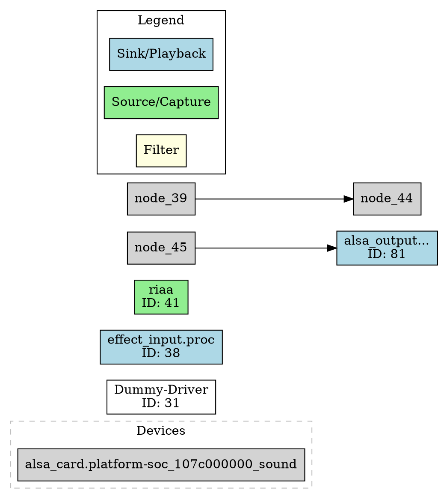

# Graph API

The Graph API provides visual representations of the PipeWire audio topology.

## Base URL

All endpoints are prefixed with `/api/v1`

## Endpoints

### GET /graph

Returns a DOT format graph of the audio topology.

**Response:**
- Content-Type: `text/vnd.graphviz`
- Body: DOT format graph

**Example:**
```bash
curl http://localhost:2716/api/v1/graph
```

**Response:**


### GET /graph/png

Returns a PNG image of the audio topology graph. Requires `graphviz` to be installed on the system.

**Response:**
- Content-Type: `image/png`
- Body: PNG image data

**Errors:**
- 404 Not Found: If graphviz is not installed

**Example:**
```bash
curl -o graph.png http://localhost:2716/api/v1/graph/png
```

## Node Colors

The graph uses color coding to distinguish different node types:

| Color | Node Type |
|-------|-----------|
| Light Blue | Sink / Playback |
| Light Green | Source / Capture |
| Light Yellow | Filter |
| White | Other audio nodes |
| Light Gray | Devices |

## Notes

- Only audio nodes are shown (MIDI and video nodes are filtered out)
- Devices are shown in a separate cluster
- Links represent audio connections between nodes (aggregated from port-level links)
- The graph uses left-to-right layout (`rankdir=LR`)
