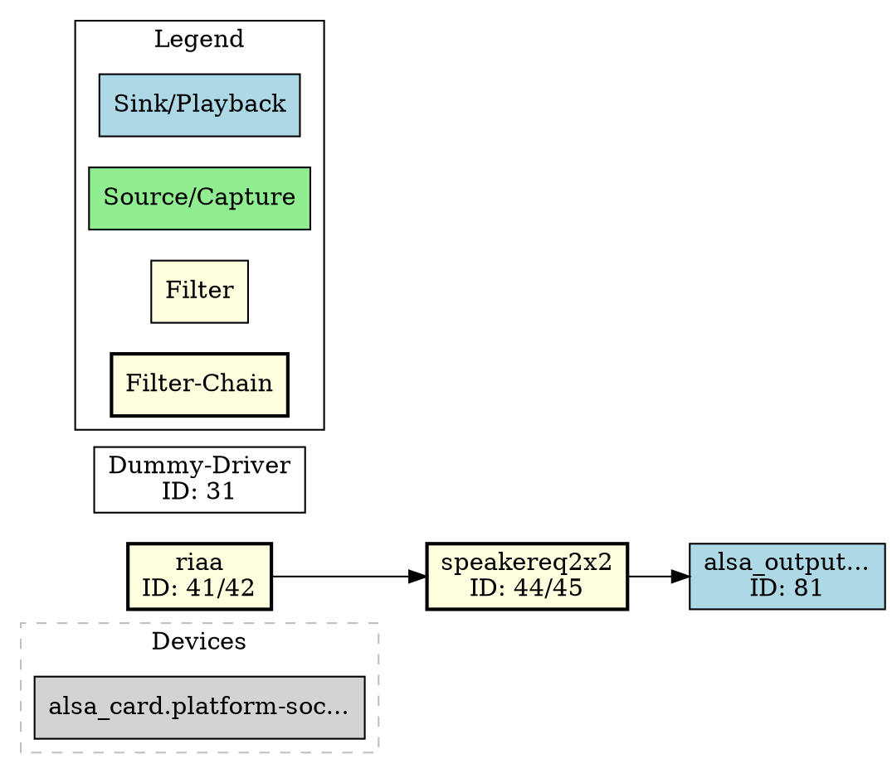

# Graph API

The Graph API provides visual representations of the PipeWire audio topology.

## Base URL

All endpoints are prefixed with `/api/v1`

## Endpoints

### GET /graph

Returns a DOT format graph of the audio topology.

**Response:**
- Content-Type: `text/vnd.graphviz`
- Body: DOT format graph

**Example:**
```bash
curl http://localhost:2716/api/v1/graph
```

**Response:**


### GET /graph/png

Returns a PNG image of the audio topology graph. Requires `graphviz` to be installed on the system.

**Response:**
- Content-Type: `image/png`
- Body: PNG image data

**Errors:**
- 404 Not Found: If graphviz is not installed

**Example:**
```bash
curl -o graph.png http://localhost:2716/api/v1/graph/png
```

## Node Colors

The graph uses color coding to distinguish different node types:

| Color | Node Type |
|-------|-----------|
| Light Blue | Sink / Playback |
| Light Green | Source / Capture |
| Light Yellow | Filter / Filter-Chain |
| Light Yellow (bold) | Filter-Chain (combined) |
| White | Other audio nodes |
| Light Gray | Devices |

## Filter-Chain Combining

Filter-chains (audio processing pipelines with separate input and output nodes) are automatically combined into single graph nodes for clarity. This applies to:

- Nodes with `media.class: Audio/Sink` paired with `$name.output` (Stream/Output/Audio)
- Nodes with `media.class: Audio/Source/Virtual` paired with `$name.output` (Stream/Output/Audio)
- Nodes matching `$name_input.proc` / `$name_output.proc` pattern

Combined nodes display both IDs (e.g., "speakereq2x2 ID: 44/45") and use a bold border.

**Example filter-chain in graph:**
```dot
chain_44 [label="speakereq2x2\nID: 44/45", fillcolor=lightyellow, style="filled,bold"];
```

## Notes

- Only audio nodes are shown (MIDI and video nodes are filtered out)
- Devices are shown in a separate cluster
- Links represent audio connections between nodes (aggregated from port-level links)
- Internal filter-chain links (between input and output of same chain) are hidden
- The graph uses left-to-right layout (`rankdir=LR`)
